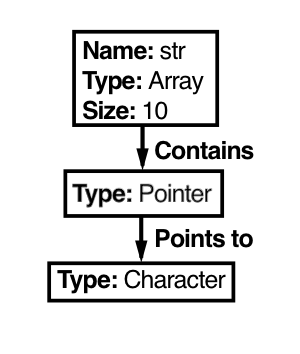
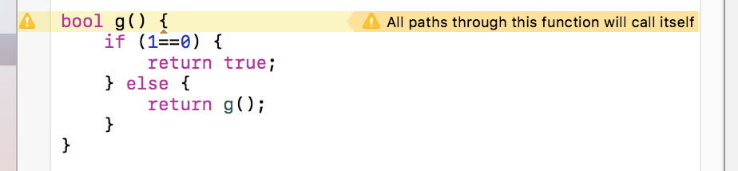
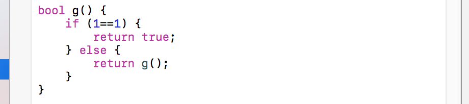

### Requirements Document - EIE BEng Project - Ravi Woods

In this document, I set out initial research I conducted into static analysers and linters, as well as issues I have found when learning C/C++. Through this research I found three areas where I think work can be made to aid beginners in programming. In section 1, I lay out each of these areas, and the work I will carry out. Then, in section 2, I summarise the work planned in an itemized specification.

#### 1.1	Pointer Declarations
Many beginners find reading and writing pointer declarations particularly difficult. For example, in the declaration ```char *str[10]```, working out that str is an array of pointers to characters, with size 10, is not easy to work out. 

This is further complicated with keywords. For example, many beginners have issues with the difference between

1. ```int const *```  : a pointer to a constant integer
2.  ```int * const```  : a constant pointer to an integer

<p style="page-break-after:always;"></p>
Another complication is with function pointers. Even advanced level programmers would struggle with ```char *(*fp)( int, float *)```. So, David Anderson devised the [Clockwise Spiral Rule](http://c-faq.com/decl/spiral.anderson.html) which makes this problem less tricky, by showing how to read these declarations using a clockwise spiral. However, from personal experience, I have still had difficulty reading these type of declarations. I believe having a graph displayed would help beginners more easily parse these types of declaration, so I plan to do just that. So, for our case above, ```char *str[10]```,  the graph would show:


#### 1.2	Recursive function calls
IDEs often provide warnings if a recursive function call will not end. For example, LLVM (with XCode) shows a warning when the recursion is infinite:

In addition, it does not warn when the function is changed:

However, one problem is that many beginners write inefficient recursive functions, which calculate results multiple times. For example, many beginners write code for the Fibonacci sequence as follows:

	#include <stdio.h>
	#include <iostream>
	
	int fib(int n)
	{
	    if (n==0)
	        return 0;
	    if (n==1)
	        return 1;
	    return(fib(n-2) + fib(n-1));
	}
	
	int main() {
	    std::cout << fib(10) << std::endl;
	    return 0;
	}

So, I plan to warn in cases where recursive execution is inefficient, like the above code or similar. One extension to this would be to show a graph of function calls - a call tree. However, this has been done by static analysers in the past, for example with [Doxygen.](https://www.stack.nl/~dimitri/doxygen/manual/diagrams.html)

#### 1.3	Off-by-one errors
Another common issue encountered by beginners is the off-by-one error. This often occurs when indexing arrays. This may be because their ranges are errant:

	#include <stdio.h>
	#include <iostream>
	
	int main() {
	    int foo[5] = { 16, 2, 77, 40, 12071 };
	    for(int i = 0; i <= (sizeof foo / sizeof * foo); i++) {
	        std::cout << foo[i] << std::endl;
	    }
	} 

This also occurs when they forget that arrays index from 0:

	#include <stdio.h>
	#include <iostream>
	
	int main() {
	    int foo[5] = { 16, 2, 77, 40, 12071 };
	    for(int i = 1; i < 6; i++) {
	        std::cout << foo[i] << std::endl;
	    }
	}

While you would expect IDEs to show an array out-of-bounds error in these cases, neither Visual Studio nor XCode do this. However, some Linters do warn in these cases. [PC-Lint does warn in this case,](http://www.gimpel.com/html/value.htm) however since it is expensive, professional-grade software, we can assume that beginners won't have access to this. CppCheck, which is open source, does [check for array out-of-bounds errors](https://sourceforge.net/p/cppcheck/wiki/ListOfChecks/). However, it slips up in all but the most basic cases, for example in this case:

	#include <stdio.h>
	#include <iostream>
	
	int main() {
	    int foo[5] = { 16, 2, 77, 40, 12071 };
	    int topindex = 4+1;
	    for(int i = 0; i <= topindex; i++) {
	        std::cout << foo[i] << std::endl;
	    }
	}
	
In addition, in some cases, there is an off-by-one error without accessing an out-of-bounds index, for example in this case:

	#include <stdio.h>
	#include <iostream>
	
	int main() {
	    int foo[5] = { 16, 2, 77, 40, 12071 };
	    for(int i = 1; i < 5; i++) {
	        std::cout << foo[i] << std::endl;
	    }
	}

So, I plan to warn in two ways:

1. The first is if the range of a loop counter could access an out-of-bounds array element.
2. The second is if the range of a loop counter will access all the elements of the array, except one at the top or one at the bottom.

In addition, if time allows, I aim to perform a similar task with C++ data structures, namely with iterators and vectors.

******

#### 2	Itemized Specification
1. The final solution will be in browser, taking code from an in-browser code editor
2. The solution will analyse the code as you type to show tips and warnings
3. For any pointer declaration, the user must be able to see a graph of the decleration.
	1. For arrays in these graphs, the name, size and type of the contained data must be shown
	2. For functions, the name (if applicable), input types and output types must be shown
	3. For pointers, the name (if applicable) and data pointed to must be shown
	4. For all other data types, the name must be shown (if applicable)
	5. If any keywords (for example const or volatile) are present, these must be shown
4. For recursive function calls, if a function calls itself twice or more with the same inputs, a warning should be shown.
5. Where there is an off-by-one error in an array index within a control structure, a warning should be shown.
	5. If the range of a loop counter could access an out-of-bounds array element, a warning should be shown.
	6. If the range of a loop counter will access all the elements of the array, except the first element, a warning should be shown.
	7. If the range of a loop counter will access all the elements of the array, except the last element, a warning should be shown.
6. (If time allows) Show the same warnings in (5), but when vectors and iterators are used.
7. The final solution should be easy to use, with no manual or tutorial needed.